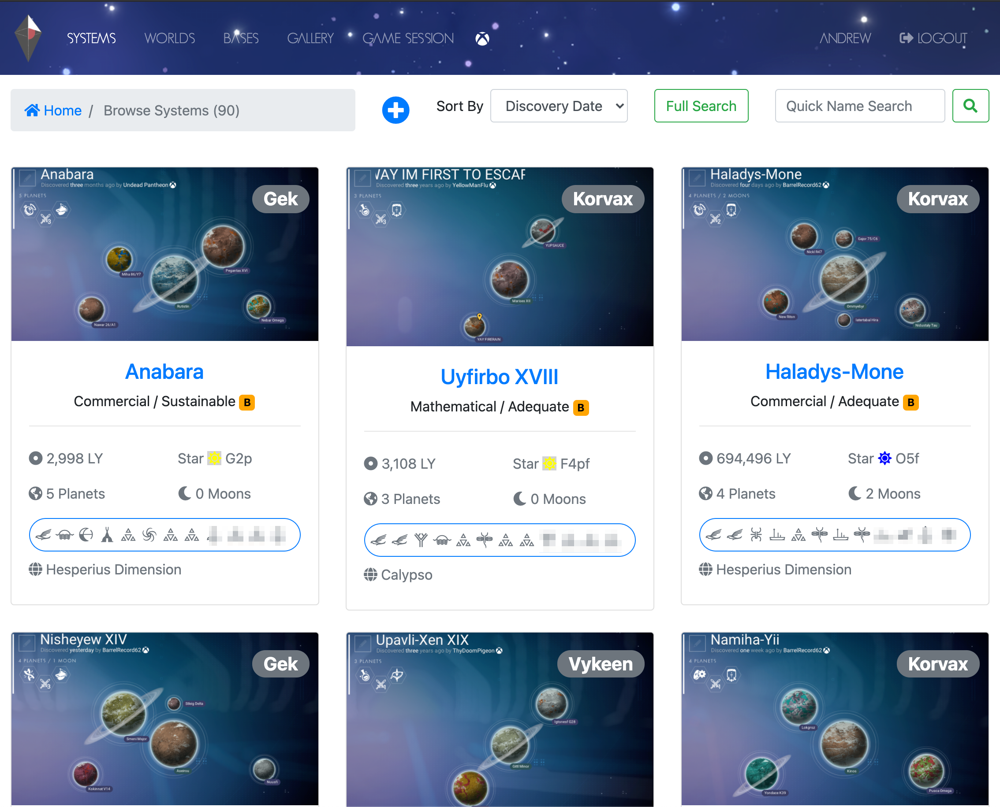
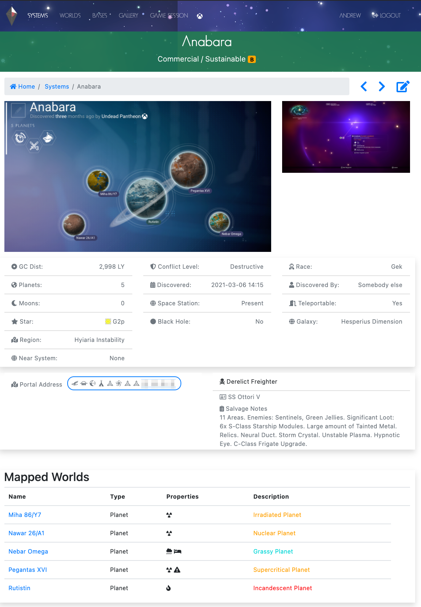
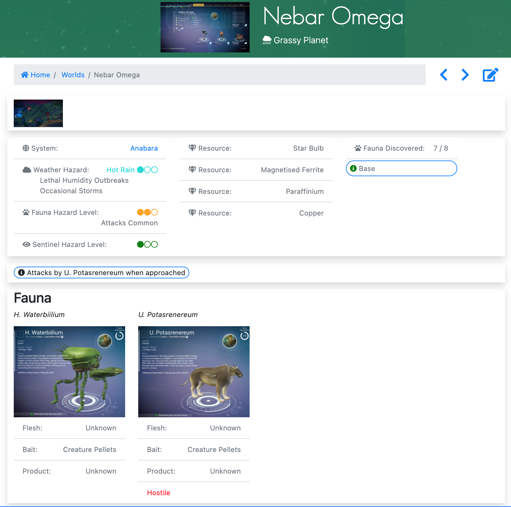
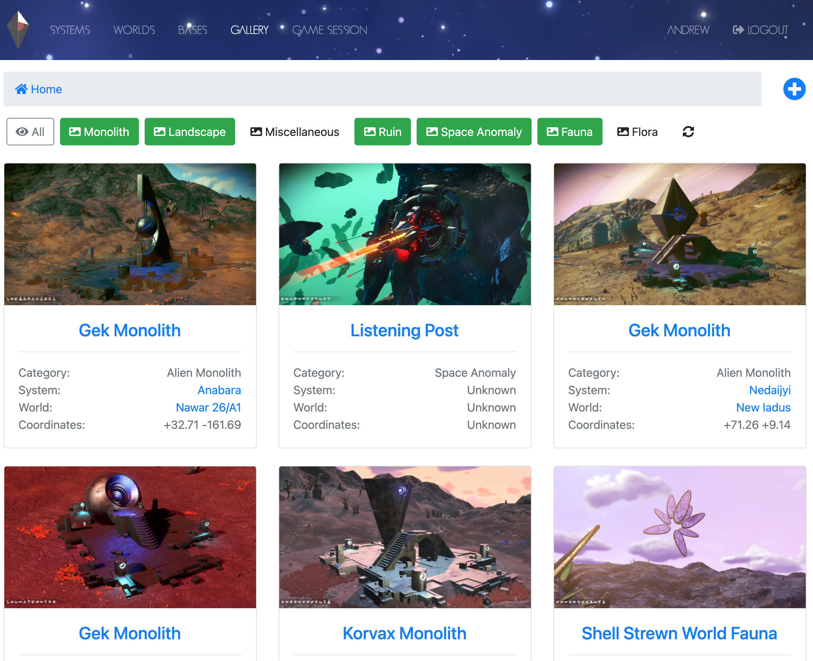

# NMS Traveller's Log
This Python Django application lets you record various discoveries you make in the [No Man's Sky](https://www.nomanssky.com/) video game by Hello Games.

## Getting Started
### Prerequisites
You will need the following software installed before following these instructions.

* Python 3
* git

### Clone this repository
To run this software you will need to use `git` to download a copy of the source code onto your computer.

Use the following command in a terminal or command line window:

`$ git clone https://github.com/walkeras/nms-traveller-log.git`  

After running the command above you will have a copy of the project in a folder named `nms-traveller-log` the current directory.

The rest of the instructions in this Getting Started section use a terminal or command line window.
## Setup
* Run the following commands to activate a virtual Python environment for the project.

On Mac, Linux or Windows:  
`$ cd nms-traveller-log`  

On Mac/Linux:  
`$ python3 -m venv venv`  

On Windows:  
`C:\> py -m venv venv`

On Mac/Linux:  
`$ source venv/bin/activate`  

On Windows:  
`C:\> .\venv\scripts\activate`

* The following command will download and install all other Python dependencies the project requires in order to run.

On Mac, Linux or Windows:  
`$ pip install -r requirements.txt`  

* The following commands initialise the database and prepare the web server.


On Mac/Linux:  
`$ python3 manage.py makemigrations`  
`$ python3 manage.py migrate`  
`$ python3 manage.py collectstatic --noinput`   

On Windows:  
`C:\> py manage.py makemigrations`  
`C:\> py manage.py migrate`  
`C:\> py manage.py collectstatic --noinput`   


* The following command will prompt you to create a superuser and choose a password for that user. This will be the user you login to the application as.

On Mac/Linux:  
`$ python3 manage.py createsuperuser`  

On Windows:  
`C:\> py manage.py createsuperuser`  

* The following commands will load a starter set of data into common reference tables used by the application. This step is optional but recommended to bypass some tedious initial data entry that you would otherwise need to perform.

On Mac/Linux:  
`$ python3 manage.py loaddata doc/db/galaxy.json`  
`$ python3 manage.py loaddata doc/db/economylevel.json`  
`$ python3 manage.py loaddata doc/db/resource.json`  

On Windows:  
`C:\> py manage.py loaddata doc/db/galaxy.json`  
`C:\> py manage.py loaddata doc/db/economylevel.json`  
`C:\> py manage.py loaddata doc/db/resource.json`  

* Finally, open up the `nms/settings.py` file in a text editor and update the `TIME_ZONE` setting to match your timezone. For example:
```
TIME_ZONE = 'America/Los_Angeles'
```
A list of valid timezone values can be found at: https://en.wikipedia.org/wiki/List_of_tz_database_time_zones

You are now ready to run the application.

---
## Running
Run the following commands from the `nms-traveller-log` folder.

On Mac/Linux:  
`$ source venv/bin/activate`  
`$ python3 manage.py runserver`  

On Windows:  
`C:\> .\venv\scripts\activate`  
`C:\> py manage.py runserver`  

If all has gone well you see something similar to the below indicating that the application has started successfully.

```
System check identified no issues (0 silenced).
March 13, 2021 - 13:57:23
Django version 3.1.7, using settings 'nms.settings'
Starting development server at http://127.0.0.1:8000/
Quit the server with CONTROL-C.
```

You can stop the application at any time by pressing Ctrl-C.

## *Important* - After a Fresh Install
1. Open [http://localhost:8000/admin](http://localhost:8000/admin) in your browser and login as the superuser you created previously.
1. **Create a new Game Session.** At least one Game Session is required to exist for the application to function properly.
1. Click View Site at the top right of the page to go to the main Systems page, or stay in admin site and start adding your discoveries.

## Using the application
Open your browser and go to [http://localhost:8000/](http://localhost:8000/) to access the main page and login (if you have not done so already) as the superuser you created earlier. From here you can view and search all your discoveries in a user-friendly interface.

To record and edit your discoveries go to [http://localhost:8000/admin](http://localhost:8000/admin) to access the admin pages for the application's discoveries database. You can get back to the main viewing site by clicking the View Site link at the top right of the page.

**Tip:** There are dedicated edit buttons on some pages that will take you directly to the admin pages for editing a discovery. After making an update to a discovery you can use the back-button in your browser to back-track to the view page for the discovery you edited and then refresh that page to get an updated view of the discovery.

The application's discoveries database is located in the `nms-traveller-log` folder in a file named `db.sqlite3`. You may make a copy of this file to create a backup of the database containing all your discoveries. You should also take a copy of the `media` folder which contains all the linked images you have uploaded to the application.

### Main Systems page


### System Details page


### World Details page


### Gallery


---
## Built With

* [Django](https://www.djangoproject.com/) - Django is a high-level Python Web framework

## Authors

* **Andrew Walker** - *Project Maintainer*

See also the list of [contributors](https://github.com/your/project/contributors) who participated in this project.

## License

This project is licensed under the New BSD License - see the [LICENSE.txt](LICENSE.txt) file for details.

## Acknowledgments

* [Hello Games](https://hellogames.org/) - For creating the wonderfully immersive and continually expanding universe that is [No Man's Sky](https://www.nomanssky.com/).
* [Brad Traversy on Udemy](https://www.udemy.com/user/brad-traversy/) - For Django and web development training.
